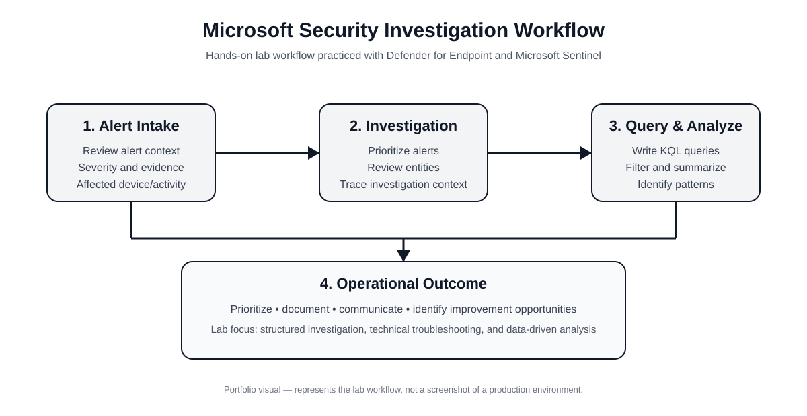
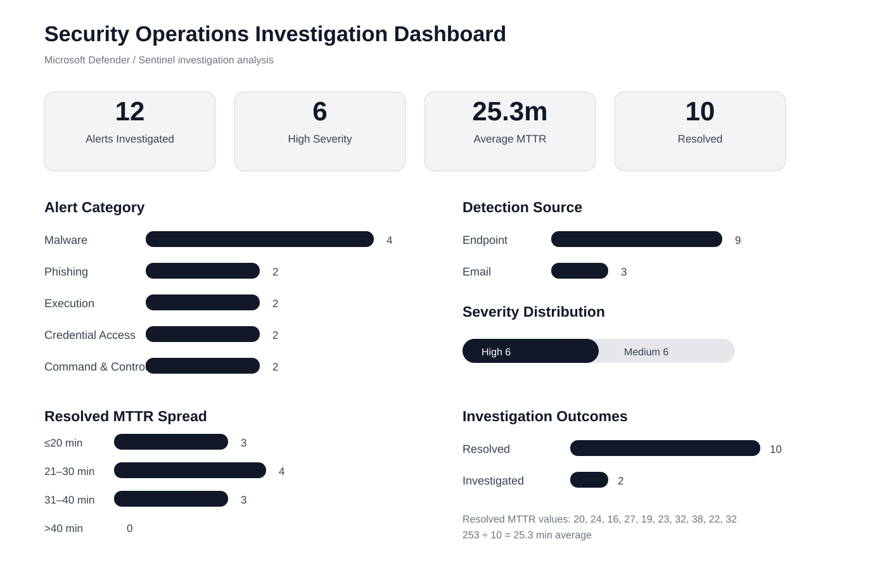
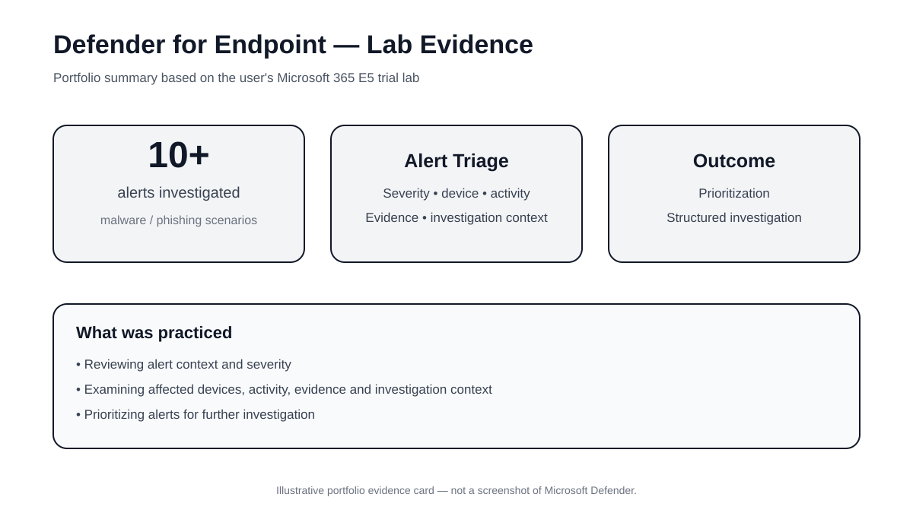
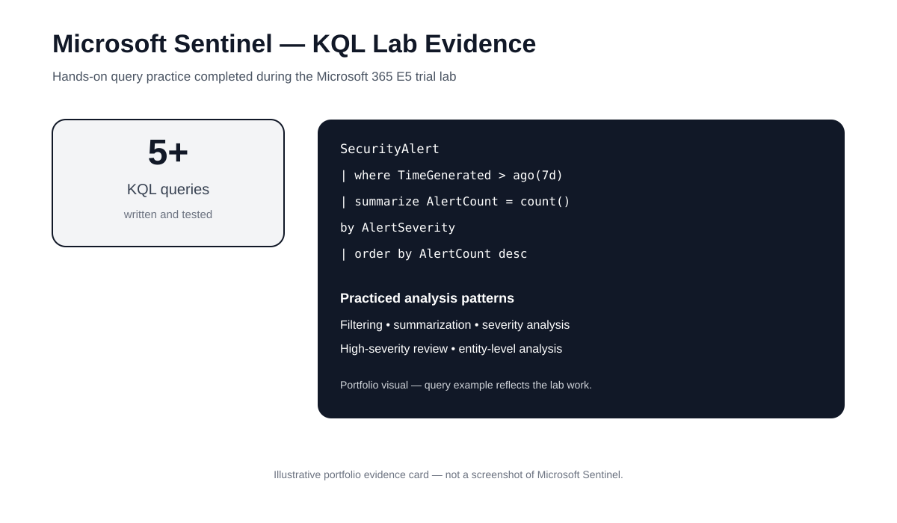

# Microsoft Security Investigation Lab

Microsoft security investigation project focused on endpoint alert triage, Microsoft Sentinel, KQL-based investigation, and security operations analytics.



## Security Operations Dashboard



### Investigation Summary

| KPI | Result |
|---|---:|
| Alerts investigated | 12 |
| High severity | 6 |
| Medium severity | 6 |
| Resolved | 10 |
| Investigated | 2 |
| Average MTTR | 25.3 min |
| Malware alerts | 4 |
| Phishing alerts | 2 |

## Defender for Endpoint



The investigation covered malware, phishing, suspicious PowerShell activity, credential-access behavior, and unusual network connections.

Analysis included:
- Alert severity and context
- Detection source
- Affected device and entity
- MITRE ATT&CK technique mapping
- Investigation status
- Response action
- Mean time to resolution

## Microsoft Sentinel & KQL



I wrote and tested **5+ KQL queries** covering filtering, aggregation, severity analysis, and entity-level investigation.

### Alert investigation with AlertInfo and AlertEvidence

```kql
AlertInfo
| where Timestamp > ago(30d)
| where ServiceSource == "Microsoft Defender for Endpoint"
| join AlertEvidence on AlertId
| project Timestamp, AlertId, Title, Severity,
          Category, DetectionSource, DeviceName,
          EntityType, AttackTechniques
| order by Timestamp desc
```

### High-severity alerts

```kql
AlertInfo
| where Timestamp > ago(30d)
| where Severity == "High"
| summarize AlertCount = count()
    by Category, DetectionSource
| order by AlertCount desc
```

### MTTR analysis

```kql
SecurityAlert
| summarize
    AlertCount = count(),
    AvgMTTR = avg(MTTR_Minutes)
    by Severity
| order by AvgMTTR desc
```

## Investigation Dataset

The project dataset contains alert-level investigation fields including:

- Alert ID
- Timestamp
- Alert title
- Category
- Severity
- Service source
- Detection source
- MITRE ATT&CK technique
- Device
- Entity type
- Investigation status
- Action taken
- MTTR

[View the investigation dataset](data/security_alerts.csv)

[View KPI summary](data/security_metrics.csv)

## Security & Analytics Skills

**Microsoft Security:** Defender for Endpoint, Microsoft Sentinel, Defender for Cloud, Defender for Office 365  
**Security Analytics:** Alert Triage, Incident Investigation, Prioritization, Evidence Review, MITRE ATT&CK Mapping  
**Querying:** KQL, SQL  
**Analytics:** Power BI, Python, Pandas, Excel  
**Operations:** Escalation Management, RCA, SLA/MTTR Analysis, Technical Troubleshooting

## Related Analytics Project

### Helpdesk KPI Dashboard

**3,672 raw ticket rows → 3,600 unique tickets**

Analysis includes SLA adherence, CSAT, repeat tickets, MTTR, data quality, SQL-based deduplication, Power BI, Python/Pandas, and Streamlit.

Repository: https://github.com/sajidmanzoor730/helpdesk-kpi-dashboard

## Investigation Workflow

**Alert → Triage → Investigate → Query → Analyze → Prioritize → Respond → Operational Outcome**

This project demonstrates the combination of technical troubleshooting, security investigation, KQL analysis, and operational reporting.

---

**Sajid Manzoor**  
Data Analytics | Technical Operations | Microsoft Security  
GitHub: https://github.com/sajidmanzoor730
