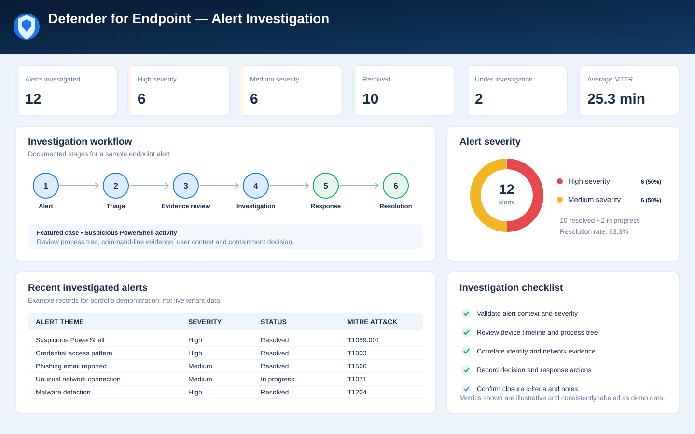
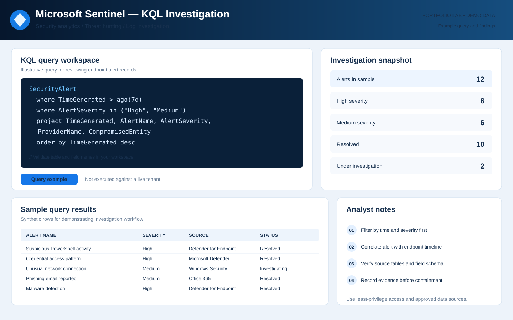
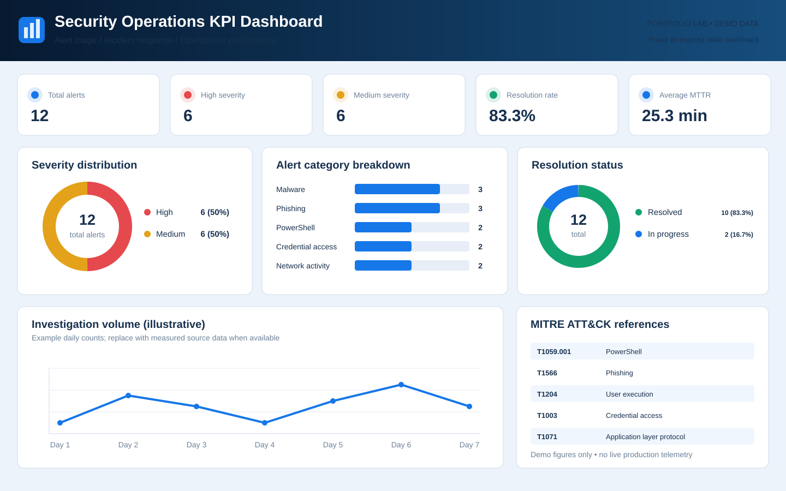

# Security Portfolio Dashboard Visuals

These are standalone SVG dashboard mockups created for the portfolio. They use illustrative demo data and are not screenshots from a live Microsoft tenant.

## 1. Defender for Endpoint — Alert Investigation

[Open the SVG](assets/defender-alert-investigation.svg)

## 2. Microsoft Sentinel — KQL Investigation

[Open the SVG](assets/sentinel-kql-investigation.svg)

## 3. Security Operations KPI Dashboard

[Open the SVG](assets/security-operations-kpi-dashboard.svg)

## Demo metrics

- 12 alerts investigated
- 6 high severity and 6 medium severity
- 10 resolved and 2 under investigation
- 83.3% resolution rate
- 25.3-minute average MTTR

**Note:** These are portfolio demonstration visuals. Any case details, daily trends, or sample query rows are illustrative and should not be represented as actual production findings.
